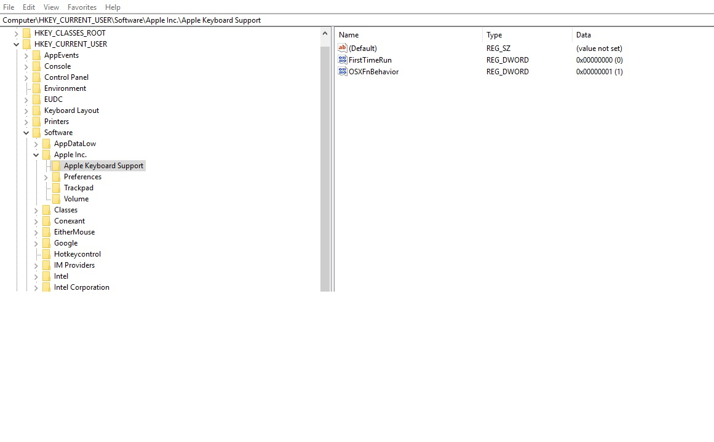
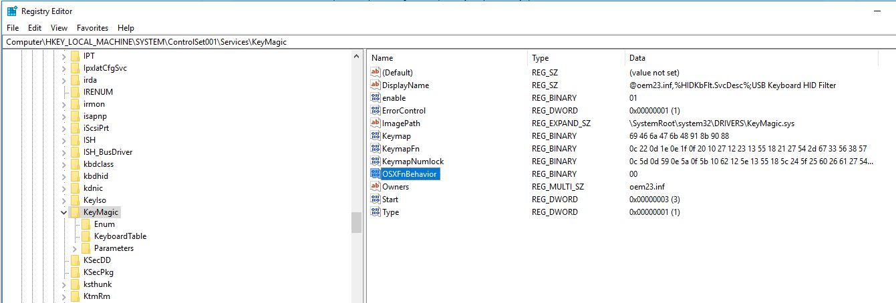

# supportfiles
Support files I need to run my peripherals under windows


### Pairing Apple keyboard on Windows 10

Turn on the keyboard.  
Press and hold Command + w until the keyboard light begins blinking, indicating the keyboard is ready to pair.  
Use Windows Bluetooth settings to pair the keyboard, entering the same code (e.g. 123456 Enter) on both ***internal and external keyboards.***  
[Source](https://gist.github.com/mcandre/a1c6915d2e338fef6a42e54655d28062)

## Windows Keyboard shortcuts for VSCode and Visual Studio
- SHIFT + DELETE : Deletes the whole line. 
- CONTROL + BACKSPACE : Deletes all characters before cursor.
- CONTROL + DELETE : Deletes all characters after the cursor.

## Closing windows on the left side:
- Turns out you are able to close windows by double clicking on the left side of a window. You can also open a quick menu by hitting `alt + space` then you can use the x, n to close or minimize. More infor [here](https://ux.stackexchange.com/questions/55260/whats-the-point-of-closing-windows-by-double-clicking-their-top-left?newreg=257696e490004174894f6e176940194e)

# Steps for Apple Magic Mouse
- Use the driver from bootcamp.  
https://www.linickx.com/apple-magic-mouse---fixing-windows-10-scrolling  
https://support.apple.com/en-am/HT204048  
`Control Panel\Hardware and Sound\Devices and Printers`
https://kevinbecker.org/blog/2012/09/17/reverse-scrolling-on-windows-8  
- Change the "Choose how many lines to scroll each time" to 1.
- Windows does not have elastic scrolling so even that setting will feel weird because the mouse will stop scrolling right away when you let go.
- Reverse scrolling using this: https://github.com/jamie-pate/flipflop-windows-wheel


# Split keyboards

I have been using the microsoft sculpt keyboard (semi-split) for since 2019 but I have deciced to start using a completly split keyboard at the end of 2021. I have the Kinesis Freestyle 2 for mac keyboard which I use in windows. The main issues I faced with the transition is that the special keys like left control or command keys are not lighned up with the letter X. The problem with this is that I have a mental muscle memory of using the distance from the command/control key to things like cut, paste, select all, etc. After using for about a week, I decided that I need to look into a diferent way to engage the control key so I am mapping the right shit to take over this responsbility. The hope is that I dont have to move my finger to the bottom row (expect for my thumb when pressing the space bar, and even when press the directional key -- I end moving mywhole hand which is okay. ) Idealy I should be able to map the left space bar to also be control but the system can not differenciate lefrt of right space bars (the new kinesis Freestyle pro is able to do this on hardware)

## Warning
Getting the `Scancode Map` wrong can prevent you from even logging into computer. Imagine you accidently map all control, alt, keys? I dont even know how this can be fixed. Be carefull with the below notes.

# Map the windows key to CRL
- https://www.howtogeek.com/howto/windows-vista/map-any-key-to-any-key-on-windows-xp-vista/

# Mapping CapsLock to something more useful
- http://vim.wikia.com/wiki/Map_caps_lock_to_escape_in_Windows
- Mapping LAlt, LWin to RCtrl, LCtrl is the best thing that I could come up with so  
 I dont have to think about when it switch from a Mac keyboard to a Windows layout.  
 The problem with this approach is that I do not have an ALT on the left side to address this problem I mapped capslock to be left alt which is very helpful in windows to switch windows. 
 

# Settings for Windows Sharp Keys app


I should probably look in the code for Windows Sharp Keys but in essence the app interact with the following:

Open Registry editor:
`Computer\HKEY_LOCAL_MACHINE\SYSTEM\CurrentControlSet\Control\Keyboard Layout`


This is how to we can get the contents of the binary file and convert it to the text below

```ps
$keyboard_layout = Get-ItemProperty -Path 'HKLM:\\SYSTEM\CurrentControlSet\Control\Keyboard Layout'
$keyboard_layout_base64string = [convert]::ToBase64String($keyboard_layout.'Scancode Map')
$keyboard_layout_base64string 


```
```ps
# Decode
$keyboard_layout_base64string = "AAAAAAAAAAACAAAAHQBc4AAAAAA="
$keyboard_layout_bytearray = [convert]::FromBase64String($keyboard_layout_base64string )
Set-Itemproperty -path 'HKLM:\\SYSTEM\CurrentControlSet\Control\Keyboard Layout' -Name 'Scancode Map' -value $keyboard_layout_bytearray
$keyboard_layout = Get-ItemProperty -Path 'HKLM:\\SYSTEM\CurrentControlSet\Control\Keyboard Layout'
$keyboard_layout.'Scancode Map'
```
 
# How to enable the F key (fkeys) in a the magic keyboard without bootcamp.
```
HKEY_LOCAL_MACHINE\SYSTEM\ControlSet001\Services\KeyMagic\

and set the value for “OSXFnBehavior” to 0

ALSO, Navigate to;

HKEY_LOCAL_MACHINE\SYSTEM\CurrentControlSet\Services\KeyMagic\

and set the value for “OSXFnBehavior” to 0
```
Complete instructions here: http://1428systems.com/uncategorized/making-apple-aluminum-keyboard-work-under-windows/




You can also find out how to edit your settings for the track pad here: https://superuser.com/questions/172658/anyone-know-how-to-modify-settings-for-the-apple-magic-trackpad-on-windows-with

## Windows Stuff

check why desktop restarted 

// this only shows 10 logs. 
```
wevtutil qe System /q:"*[System[(EventID=41) or (EventID=109) or (EventID=1074) or (EventID=6006) or (EventID=6005) or (EventID=6008)]]" /c:10 /f:text /rd:true 
```
https://answers.microsoft.com/en-us/windows/forum/all/the-kernel-power-manager-has-initiated-a-shutdown/4a22c353-4aa1-4359-89e0-379156b93cba
https://www.windowscentral.com/how-find-reason-pc-shutdown-no-reason-windows-10


Get a report of power stuff in an html form:
`powercfg /systempowerreport`

The html gets saved on the current directory. 

# Git Settings
This fixes the line ending so you can use the git from inside bash ubuntu in windows.
`git config --global core.autocrlf true`

You can use the same credentials from windows inside ubuntu
 https://stackoverflow.com/a/47350274/3705470  
 ``git config --global credential.helper "/mnt/c/Program\ Files/Git/mingw64/libexec/git-core/git-credential-wincred.exe"``  
 
 Add name and email
 
 `git config --global user.name "Cheyo Jimenez"`   
 `git config --global user.email johndoe@example.com`  
https://git-scm.com/book/en/v2/Getting-Started-First-Time-Git-Setup

Edit the global settings:  
`git config --edit --global`

Edit the default git editor.
`git config --global core.editor "code --wait"`

# Shortcuts
- You can set the snipping tool to act just like the screenshot tool in mac
https://www.quora.com/How-do-I-launch-Snipping-tool-in-Windows-and-the-actual-new-snip-command-simultaneously

- I have also tried which does an excelent job at mapping thing like Command + H to hide windows. ETC. 
- https://inchwest.com/hotkeycontrol/#mapkeyboard

# Git Command Prompt

VS Code has its own command promt that can be more userfriendly that the build in windows ones. 
You should map the windows git bash command prompt to be used inside the vs code command prompt. 
This allows copy and paste among other nice things. 


Add this to the .bashrc or .bash_profile

```
# Default editor
export EDITOR='code --wait'
export VISUAL='code --wait'

# Git command prompt
GIT_PS1_SHOWDIRTYSTATE=true
export PS1='[$USER@$(hostname) \W$(__git_ps1)]\$ '

# This will print the current directory with the correct scapes when there are spaces in the path.
alias cwd='printf "%q\n" "$(pwd)"'

# add a way to change paths from windows to unix. This uses the tooling inside Git for windows.
# http://www.mingw.org/wiki/Posix_path_conversion
alias cygpath="/mnt/c/Program\ Files/Git/usr/bin/cygpath.exe"

#Add default start up dir. This will make sure that you start in a windows dir location.
# Add your user name or the place where you keep all your local repos.
cd /mnt/c/Users/

# emulate open from mac
alias open=explorer.exe
```

# WSL  
``wslpath to do WSL<->Windows path conversions.``
https://docs.microsoft.com/en-us/windows/wsl/release-notes#build-17063

`wslconfig.exe /list` This will show all the current installed distributions.  
